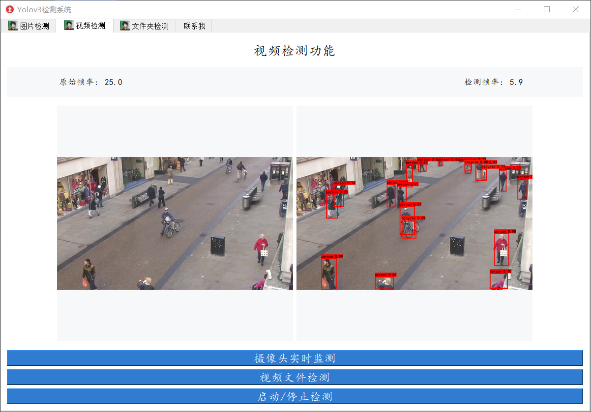
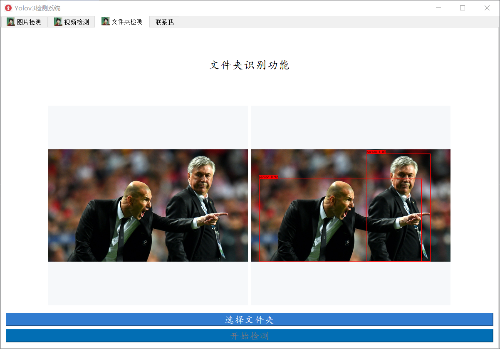

## yolov3-pytorch-simpleUI

## 功能介绍
在 [up主Bubbliiiing](https://space.bilibili.com/472467171/) 的 [yolov3-pytorch](https://github.com/bubbliiiing/yolo3-pytorch) 代码基础上上添加一个简单的UI。
* 可以检测单张图片
* 可以检测视频
* 可以检测摄像头
* 可以检测图片文件夹

## 快速启动
请按照up的 [yolov3-pytorch](https://github.com/bubbliiiing/yolo3-pytorch) 步骤进行文件下载和配置环境，除了up主需要的环境外，需要自行安装pyqt5，指令如下：
```
pip install PyQt5
```
* 有关YOLOv3模型相关的内容只需要按照up主的来就行，不需要改动代码
* 之后就可以直接运行`main.py`，启动UI程序

## 效果



